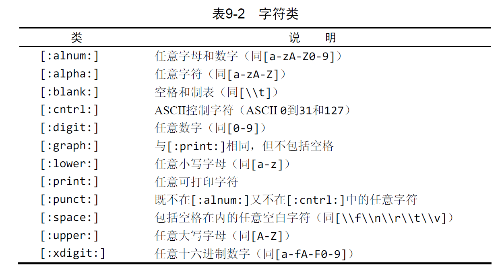

# MySQL必知必会

net start MySQL80

net stop MySQL80

> 什么是数据库
> 

数据库是一个以某种有组织的方式存储的数据集合。

要明确一个概念，**数据库软件（DBMS）**。数据库是通过DBMS创建和操纵的容器。数据库究竟是什么不重要，因为你并不直接访问数据库。一般是使用DBMS，它会替我访问数据。

> 表（table）
> 

表是一种结构化文件，可以用来存储某种特定类型的数据。

表，是某种特定类型数据的结构化清单。

一个表放一种东西。比如顾客的清单，和订单的清单不应该放在一个表里，而应该放在两个表。

数据库中的每个表都有一个名字，这个名字是**唯一**的。数据库中没有其他表有相同的名字。

> 模式（schema）
> 

表具有一些特性，这些特性定义了数据在表中如何存储，如可以存储什么样的数据，数据如何分解，各部分信息如何命名，等等。描述表的这组信息就是所谓的模式，模式可以用来描述数据库中特定的表以及整个数据库（和其中表的关系）。

> 列（column）
> 

表中的一个字段。所有表都是由一个或多个列组成的。

在顾客表中，一个列存储着顾客编号，另一个列存储着顾客名，而地址、城市、州以及邮政编码全都存储在各自的列中。

每个列都有相应的数据类型。定义可以存储数据的种类。

> 行（row）
> 

行是表中的一个记录。

表中的数据是按行存储的，所保存的每个记录存储在自己的行内。

> 主键（primary key）
> 

主键：唯一标识一条记录，不允许重复，不允许为空（用来保存数据的完整性）

应该保证每个表都有一个主键，以便于管理。

在使用多列作为主键时，上述条件必须应用到构成主键的所有列，所有列值的组合必须是唯一的

> 什么是SQL
> 

SQL是结构化查询语言（Structured Query Language）的缩写。SQL是一种专门用来与数据库通信的语言。

DBMS可分为两类：一类为基于共享文件系统的DBMS，另一类为基于客户机—服务器的DBMS。前者用于桌面用途，通常不用于高端或更关键的应用。

# SQL语句常识

---

多条SQL语句必须以（；）分号进行分隔

SQL语句不区分大小写，SELECT和select和Select语句都是一样的。对SQL关键字进行大写，其他列和表名进行小写，这样代码就会更易于阅读和调试。

SQL语句，会忽略空格，SQL语句可以在一行上给出，也可以分成许多行。分行能看的清楚点

# 1. 基础常用SHOW命令

> USE crashcourse
> 

选中数据库，这个命令就会选中crashcourse这个数据库。

> SHOW DATABASE
> 

返回可用数据库的一个列表。

> SHOW TABLES
> 

返回**当前选择**的数据库内可用表的列表

> SHOW COLUMNS FROM customers
> 

该命令要求给出一个表名，对每个字段返回一行，包含这个字段的字段名，数据类型，是否允许null，键信息，默认值以及其他信息。这个语句还有缩略版 DESCRIBE customers

- SHOW STATUS  显示服务器状态信息
- SHOW CREATE DATABASE db_name ||  SHOW CREATE TABLE  tbl_name 显示创建时候的语句
- SHOW GRANTS FOR user 显示授予用户的安全权限
- SHOW ERRORS || SHOW WARNINGS 用来显示服务器错误或警告信息

# 2. 检索数据SELECT语句

---

## 检索单列

```sql
SELECT prod_name 
FROM products
```

从products表里检索名为prod_name的列。

这样的检索结果既没有**过滤**，也没有**排序**。以何种顺序返回的都不奇怪。

## 检索多列

```sql
SELECT prod_name，prod_id，prod_price 
FROM products
```

在列名之间加上，逗号。最后一个列名是不需要加逗号的。加了会报错。

## 检索所有列

```sql
SELECT * 
FROM products
```

星号（*）通配符。如果使用通配符，那么就会返回表中的所有列。（*）可能会检索出不必要的信息，降低性能。

## 检索不同的行

```sql
SELECT DISTINCT vend_id 
FROM products
```

这个时候，只会返回值不同的行，如果值相同，那这些行是不会返回的。

**DISTINCT 关键字**必须直接放在列名的前面。

## 限制结果

```sql
SELECT  vend_id 
FROM products LIMIT 5；
```

那么返回的行，最多就只会有五行。**LIMIT 关键字**

LIMIT 5,5 加入两个参数的话，第一个数是**开始位置**，第二个数是要检索的行数。

第一行是 **行0 而不是 行1**

LIMIT 3,4  = LIMIT 4 OFFSET 3

## 表名和列名都是可以完全限定的

```sql
SELECT products.prod_name 
FROM crashcourse.products
```

表名和列名都进行了限定

# 3. 排序输出结果

---

## 排序数据

SQL 语句有 子句（clause） 概念。一个子句通常由一个关键字和所提供的数据组成。

```sql
SELECT prod_name
FROM products
ORDER BY prod_name;
```

**关键字ORDER BY**。有了这个子句，返回的行就会进行排序。

实际使用的时候，不一定要用所选择的列作为ORDER BY的参数。可以使用**非检索的列**进行排序。

## 按多个列进行排序

```sql
SELECT prod_id, prod_price, prod_name
FROM products
ORDER BY prod_price, prod_name ;
```

排序完全按照所规定的顺序进行。在上面这个例子中，**仅在prod_price相同时，才按prod_name进行排序**。如果prod_price的值都是不相同的话， 就不会按prod_name进行排序。

## 指定排序方向

```sql
SELECT prod_id, prod_price, prod_name
FROM products
ORDER BY prod_price DESC ;
```

**关键字DESC**，数据排序默认时升序排列，用了这个关键字就可以进行降序排序。ASC是默认的。

如果有多个的话。 

ORDER BY prod_price DESC, prod_name ;

DESC只会作用它最前面的一个列名。其他列名不影响。

## 组合使用ORDER BY  和LIMIT，检索最值

```sql
SELECT prod_price
FROM products
ORDER BY prod_price DESC 
LIMIT 1 ;
```

这样就会找到最贵的那一个。需要注意顺序。 

ORDER BY必须在FROM子句之后。而LIMIT必须位于ORDER BY语句之后。子句顺序不同会产生错误信息。

# 4. 数据过滤-WHERE子句

只检索需要的数据需要指定搜索条件（search criteria），搜索条件也称为过滤条件（filter condition）。

```sql
SELECT prod_name, prod_price
FROM products
WHERE prod_price = 2.50 ;
```

这是一个简单的相等测试，只提取出值为2.50的行。SQL允许做的事情不仅仅是相等测试。

ORDER BY语句应该位于WHERE之后。（个人理解，先筛选出来，才能进行排序）

| = | 等于 |
| --- | --- |
| <> | 不等于 |
| != | 不等于 |
| < | 小于 |
| <= | 小于等于 |
| > | 大于 |
| >= | 大于等于 |
| BETWEEN | 在指定两个值之间 |

```sql
SELECT prod_name, prod_price
FROM products
WHERE prod_name = 'fuses' ;
```

MySQL在执行匹配的时候不区分大小写。Fuses和fuses都能匹配。

```sql
SELECT prod_name, prod_price
FROM products
WHERE prod_price < 10;
```

找出价格小于10 的行。

```sql
SELECT prod_name, prod_price
FROM products
WHERE prod_price BETWEEN 5 AND 10;
```

BETWEEN的匹配稍稍有点不一样，要给定一个区间。

## 空值检查

在创建表的时候， 可以指定其中的列是否可以不包含值。不包含值的时候，称其包含空值NULL

```sql
SELECT prod_name
FROM products
WHERE prod_price IS NULL;
```

这条语句会返回没有价格的所有产品，如果表中没有这样的行，就不会返回数据。

NULL和不匹配是不一样的。未知具有特定含义，数据库不知道它们是不是匹配的。

# 5. 数据过滤-组合WHERE语句

## AND操作符

之前使用的时候单一条件的过滤。有时候我们希望更强的过滤控制。MySQL同样也允许给出多个WHERE语句。可以用逻辑操作符，来组合这些WHERE子句（AND 或 OR）

```sql
SELECT prod_id, prod_name, prod_price
FROM products
WHERE vend_id = 1003 AND prod_price <= 10;
```

这条语句会返回由供应商1003制造并且价格小于等于10元的所有产品名称和价格。这条语句是两条WHERE 语句的组合。用了关键字AND进行组合。那么检索的结果一定会满足这两个条件。

## OR操作符

```sql
SELECT prod_name, prod_price
FROM products
WHERE vend_id = 1002 OR vend_id = 1003;
```

 两个条件只需要满足一个，就能被检索出来。

## AND和OR操作符的运算顺序

AND操作符的运算优先级大于OR操作符。为了达到预期的效果，需要使用括号。

```sql
SELECT prod_name, prod_price
FROM products
WHERE (vend_id = 1002 OR vend_id = 1003) AND prod_price >=10;
```

使用括号的优先级最高。会优先计算括号内的内容。

## IN操作符

```sql
SELECT prod_name, prod_price
FROM products
WHERE vend_id IN (1002,1003)
ORDER BY prod_name;
```

IN操作符用来指定条件范围，范围中的每个条件都可以匹配。IN合法值由逗号进行分隔。

IN操作符后跟由逗号分隔的合法值清单，整个清单必须在圆括号中

IN操作符和OR的功能可以认为是相同的。

```sql
SELECT prod_name, prod_price
FROM products
WHERE vend_id = 1002 OR vend_id = 1003
ORDER BY prod_name;
```

这语句和之前的语句是完全一样的。

IN操作符和OR操作的区别

- 在使用较长的合法值范围时，IN操作符更加直观和清楚
- 在使用IN 时，计算次序更容易管理。
- IN操作符一般比OR操作符执行更快。
- IN的最大的优点就是可以包含其他SELECT语句，能动态的创建WHERE子句。

## NOT操作符

否定它之后所跟的任何条件

```sql
SELECT prod_name, prod_price
FROM products
WHERE vend_id NOT IN (1002,1003)
ORDER BY prod_name;
```

这样就会匹配1002和1003之外的供应商。在复杂的语句中NOT的作用更大一点。

而且容易和IN操作符联动合作。找到条件不匹配的行很简单。

# 6. 数据过滤 - 使用通配符

之前数据过滤的条件使用的值都是已知的。但是这种过滤方法并不是任何时候都好用。

**通配符**：用来匹配值的一部分的特殊字符

**搜索模式**：由字面值，通配符或两者组合构成的搜索条件。

在搜索子句中使用通配符的时候，必须使用**LIKE谓词**。LIKE指示MySQL，后面跟的搜索模式利用通配符进行匹配而不是直接相等匹配进行比较。（相等是找不出来的）

**谓词**： 从技术上来说，**LIKE是谓词而不是操作符**。它用来提醒SQL之后的语句要用通配符进行匹配。

## 百分号（%）通配符

最常使用的通配符是百分号（%）。%表示任何字符出现任意次数。例如想要找到所有以jet起头的产品，可使用以下SELECT语句。

```sql
SELECT prod_name, prod_id
FROM products
WHERE prod_name LIKE 'jet%'
```

利用了 ‘jet%’ 搜索模式。执行这条子句的时候，将检索任意以jet起头的词。

**根据MySQL的配置方式，搜索是可以区分大小写的**。

通配符可以在任意位置使用

```sql
SELECT prod_name, prod_id
FROM products
WHERE prod_name LIKE '%anvil%'
```

那么任何包含文本anvil的值都会作为匹配结果返回。

%可以匹配0个字符，但需要注意的是%是匹配不了NULL值的。

## 下划线（_）通配符

下划线，与百分号的用途一样，可以匹配任意字符，但是下划线只能匹配单个字符。不能匹配多个字符。

```sql
SELECT prod_name, prod_id
FROM products
WHERE prod_name LIKE '_ ton anvil'
```

与%能匹配0个字符不一样。_总能匹配一个字符，**不能多也不能少**。

## 注意点

- 虽然通配符很有用，但代价就是效率更低
- 不要过多使用通配符，如果其他操作可以代替，那么就用其他的方法。
- 确实需要的时候，通配符的位置也应该尽量避免出现在开头。开头的通配符搜索起来是最慢的
- 仔细注意通配符的位置。

# 7. 正则表达式进行搜索

正则表达式是用来匹配文本的特殊的串（字符集合）

如果你想替换一个页面中的所有URL为这些URL的实际HTML链接，也可以使用一个正则表达式（对于这个例子，或者是两个正则表达式）。

**MySQL用WHERE子句**对**正则表达式**提供了初步的支持，允许你指定正则表达式，过滤SELECT检索出的数据。

MySQLz仅支持多数正则表达式实现的一个很小的**子集**。

## 基本字符匹配

```sql
SELECT prod_name
FROM products
WHERE  prod_name REGEXP '1000'
ORDER BY prod_name ; 
```

除关键字LIKE被REGEXP替代外，这条语句看上去非常像使用LIKE的语句

使用了正则表达式的（.）它表示匹配任意一个字符。

```sql
SELECT prod_name
FROM products
WHERE  prod_name REGEXP '.000'
ORDER BY prod_name ; 
```

## LIKE和REGEXP的区别

```sql
# 第一条
SELECT prod_name
FROM products
WHERE  prod_name LIKE '1000'
ORDER BY prod_name ; 
# 第二条
SELECT prod_name
FROM products
WHERE  prod_name REGEXP '1000'
ORDER BY prod_name ; 
```

如果执行上述两条语句，会发现第一条语句不返回数据，而第二条语句返回一行。

LIKE匹配整个列。如果被匹配的文本在列值中出现，LIKE将不会找到它，相应的行也不被返回（除非使用通配符）。而REGEXP在列值内进行匹配，如果被匹配的文本在列值中出现，REGEXP将会找到它，相应的行将被返回。这是一个**非常重要的差别**。

- LIKE提示编译器，以后不是相等匹配，而是通配符匹配。如果没用通配符那么只有列值完全等于的时候才会被检测。假如列值是 JetPack 1000,是检测不出来的。因为除了1000还有其他字符。
- REGEXP在列值内进行匹配，列值中只要出现匹配的文本，就会被检索出来。假如列值是 JetPack 1000, 那就可以被检测出来，因为列值中存在了一个1000。

注意：

- REGEXP也可以使用^和$符号来匹配整个列值，达到和**LIKE一样**的效果。
- MySQL中的正则表达式匹配（自版本3.23.4后）不区分大小写（即，大写和小写都匹配）。为区分大小写，可使用**BINARY**关键字，如`WHERE prod_name REGEXP BINARY 'JetPack .000'`。

## 进行OR匹配

```sql
SELECT prod_name
FROM products
WHERE  prod_name REGEXP '1000|2000'
ORDER BY prod_name ; 
```

1000和2000都能匹配并返回。

## 匹配特定几个字符之一

```sql
SELECT prod_name
FROM products
WHERE  prod_name REGEXP '[123] Ton'
ORDER BY prod_name ; 
```

这里，使用了正则表达式[123] Ton。[123]定义一组字符，它的意思是匹配1或2或3，因此，1 ton和2 ton都匹配且返回。

^符号可以进行否定 , `[^123]` 就能匹配123之外的任何字符。

## 匹配一个范围

[0-9]   = [ 0123456789 ] 这两个效果是一样的

[1-3] [6-9] 也是合法的范围

[a-z] 匹配任意字母字符

```sql
SELECT prod_name
FROM products
WHERE  prod_name REGEXP '[1-5] Ton'
ORDER BY prod_name ; 
```

## 匹配特殊字符

正则表达式，本身就带关键字，比如. [] | - 这四个字符和其他字符。如果要匹配这些字符。

就应该像转义字符那样，加上\\ . 

```sql
SELECT prod_name
FROM products
WHERE  prod_name REGEXP '\\.'  # 这样就会匹配.字符了
ORDER BY prod_name ; 
```

为了匹配\ 本身，就要 \\\ 三个反斜杠

\\n  \\f  \\t 都可以匹配

一般来说正则表达式只需要一个反斜杠\就可以表示了，但是在MySQL里要求两个反斜杠。

## 匹配字符类（预定义的字符集）



## 匹配多个实例


?符号的用法，这些符号都跟前一个最近的字符关联。

```sql
SELECT prod_name
FROM products
WHERE  prod_name REGEXP '\\([0-9] sticks?\\)'  
ORDER BY prod_name ; 
```

正则表达式\\([0-9] sticks?\\)需要解说一下。\\(匹配)，[0-9]匹配任意数字（这个例子中为1和5），sticks?匹配stick和sticks（s后的?使s可选，因为?匹配它前面的任何字符的0次或1次出现），\\)匹配)。没有?，匹配stick和sticks会非常困难。

假如要匹配四个数字

```sql
SELECT prod_name
FROM products
WHERE  prod_name REGEXP '[[:digit:]]{4}'  
ORDER BY prod_name ; 
```

[:digit:] 是匹配任意数字 []{4},是指定匹配4次。

```sql
SELECT prod_name
FROM products
WHERE  prod_name REGEXP '[0-9][0-9][0-9][0-9]'  
ORDER BY prod_name ; 
```

这两个是完全等价的，很多情况下，SQL语句都不是只有一种可能。

## 定位符


```sql
SELECT prod_name
FROM products
WHERE  prod_name REGEXP '^[0-9\\.]'  
ORDER BY prod_name ; 
```

^匹配串的开始。因此，^[0-9\\.]只在.或任意数字为串中第一个字符时才匹配它们。没有^，则还要多检索出4个别的行（那些中间有数字的行）。

^

- 如果在括号中，则表示否定的意思。
- 如果在括号外，则表示匹配文本的开始

REGEXP **使用^开始表达式**，**使用$结束表达式**，就能获得和LIKE一样的效果。

### 小提示：

直接`SELECT ‘hello’ REGEXP ‘[0-9]’;`  这样的表达式就可以进行正则表达式的测试。而不需要用数据库的表。

# 8. 创建计算字段

存储在数据库表中的数据一般不是应用程序所需要的格式。

- 列数据是大小写混合的，但报表程序需要把所有数据按大写表示出来。
- 物品订单表存储物品的价格和数量，但不需要存储每个物品的总价格（用价格乘以数量即可）。为打印发票，需要物品的总价格。
- 需要根据表数据进行总数、平均数计算或其他计算。

存储在表中的数据都不是应用程序所需要的。我们需要直接从数据库中检索出转换、计算或格式化过的数据；而不是检索出数据，然后再在客户机应用程序或报告程序中重新格式化。

计算字段**并不实际存在于数据库表**中。计算字段是**运行时**在SELECT语句内创建的。

字段，基本上与列是同义词，一般来说，数据库列一般称为列，字段一般用于计算字段的连接上。

## 拼接

### 预期目标 name(location)

```sql
SELECT Concat(vend_name,'(',vend_country,')')
FROM vendors
ORDER BY vend_name ; 
```

**注意点**：大多数DBMS使用 + 和 || 来实现拼接。而MySQL使用了Concat( )函数来进行实现

Concat()拼接串，即把多个串连接起来形成一个较长的串。
Concat()需要一个或多个指定的串，各个串之间用逗号分隔。上面的SELECT语句连接以下4个元素：

- 存储在vend_name列中的名字；
- 包含一个空格和一个左圆括号的串；
- 存储在vend_country列中的国家；
- 包含一个右圆括号的串。

从上述输出中可以看到，SELECT语句返回包含上述4个元素的单个列（计算字段）。

```sql
SELECT Concat(vend_name,'(',RTrim(vend_country),')')
FROM vendors
ORDER BY vend_name ; 
```

MySQL除了支持RTrim()（去掉串右边的空格），还支持LTrim()（去掉串左边的空格）以及Trim()（去掉串左右两边的空格）。

## 使用别名

新计算列的名字是什么呢？实际上它没有名字，它只是一个值。如果仅在SQL查询工具中查看一下结果，这样没有什么不好。但是，一个未命名的列不能用于客户机应用中，因为客户机没有办法引用它。

为了解决这个问题，SQL支持列别名。别名（alias）是一个字段或值的替换名。别名用**AS关键字**赋予。请看下面的SELECT语句：

```sql
SELECT Concat(vend_name,'(',RTrim(vend_country),')') AS vend_title
FROM vendors
ORDER BY vend_name ; 
```

计算字段之后跟了文本AS vend_title。它指示SQL创建一个包含指定计算的名为vend_title的计算字段。从输出中可以看到，结果与以前的相同，但现在列名为vend_title，任何客户机应用都可以按名引用这个列，就像它是一个实际的表列一样。

## 执行算术计算

### 基础版

```sql
SELECT prod_id, quantity, item_price
FROM orderitems
WHERE order_num = 20005 ; 
```

SQL语句检索订单号20005中的所有物品

### 进阶版

```sql
SELECT prod_id, 
			 quantity,
			 item_price,
			 quantity * item_price AS expanded_price
FROM orderitems
WHERE order_num = 20005 ; 
```

输出中显示的expanded_price列为一个计算字段，此计算为quantity*item_price。客户机应用现在可以使用这个新计算列，就像使用其他列一样。

 + -  * / 运算都是被允许的

# 9. 数据处理函数

## 函数

与其他大多数计算机语言一样，SQL支持利用函数来处理数据。函数一般是在数据上执行的，它给数据的转换和处理提供了方便。

前面用来去掉串尾空格的RTrim()就是一个函数的例子。

**需要注意的是**，函数没有SQL的可移植性强。SQL语句一般都可以很好的移植。而函数可移植性不强。几乎每种DBMS的实现都支持其他实现不支持的函数。各自的差异很大。

## 文本处理函数

```sql
SELECT vend_name, Upper(vend_name) AS vend_name_upcase
FROM vendors
ORDER BY vend_name;
```

正如所见，Upper()将文本转换为大写

### 一些常用的文本处理函数


发音相近的处理搜索

```sql
SELECT cust_name, cust_concact
FROM customers
WHERE cust_contact = 'Y. Lie';
```

这样如果客户是Y。Lee的联系名的话，就不会返回结果了

```sql
SELECT cust_name, cust_concact
FROM customers
WHERE Soundex(cust_contact) = Soundex('Y. Lie');
```

这样如果客户是Y。Lee的联系名的话，就会返回结果了

在这个例子中，WHERE子句使用Soundex()函数来转换cust_contact列值和搜索串为它们的SOUNDEX值。因为Y.Lee和Y.Lie发音相似，所以它们的SOUNDEX值匹配，因此WHERE子句正确地过滤出了所需的数据。

## 日期和时间处理函数

存储日期和时间的格式是一种特殊的格式，以便能快速排序或过滤，并节省空间

一般，**应用程序不使用用来存储日期和时间的格式**，因此**日期和时间函数**总是被用来读取、统计和处理这些值。由于这个原因，日期和时间函数在MySQL语言中具有重要的作用。


### 注意

首先需要注意的是**MySQL使用的日期格式**。无论你什么时候指定一个日期，不管是插入或更新表值还是用WHERE子句进行过滤，日期必须为格式`yyyy-mm-dd`

1. 基本的日期比较

```sql
SELECT cust_id, cust_num
FROM orders
WHERE order_data = '2005-09-01';
```

存在问题： 

存储的**order_date 值为2005-09-01 11:30:05**，则WHERE order_date = '2005-09-01'失败。即使给出具有该日期的一行，也不会把它检索出来，因为WHERE匹配失败。

1. 对1的改进（仅比较日期）

```sql
SELECT cust_id, cust_num
FROM orders
WHERE Date(order_data) = '2005-09-01';
```

在仅比较日期的时候，用Date()函数。在仅比较时间的时候用 Time()函数

1. 稍微进阶（假如想**检索2005年9月下的所有订单**）

```sql
SELECT cust_id, cust_num
FROM orders
WHERE Date(order_data) BETWEEN '2005-09-01' AND '2005-09-30';
```

1. 对3的另一种实现方式

```sql
SELECT cust_id, cust_num
FROM orders
WHERE Year(order_data) = 2005 AND Month(order_data) = 9;
```

## 数值处理函数

数值处理函数仅处理数值数据。函数一般用于代数，三角或者几何运算。因此没有串或日期—时间处理函数的使用那么频繁。

具有讽刺意味的是，在主要DBMS的函数中，数值函数是最一致最统一的函数。


# 10. 汇总数据

## 聚集函数

我们经常需要汇总数据而不用把它们实际检索出来

- 确定表中行数（或者满足某个条件或包含某个特定值的行数）
- 获得表中行组的和
- 找出表列（或所有行或某些特定的行）的最大值、最小值和平均值。

上述例子都需要对表中数据（而不是实际数据本身）汇总。**实际想要的是汇总信息**。


### AVG()函数

AVG()只能用来确定**特定数值列**的平均值，而且列名必须作为函数参数给出。

为了获得多个列的平均值，必须使用多个AVG()函数。

```sql
SELECT AVG(prod_price) AS avg_price
FROM products
WHERE vend_id = 1003;
```

可以没有WHERE限定，也可以有WHERE的限定。

### COUNT()函数

COUNT()函数进行计数。可利用COUNT()确定表中行的数目或符合特定条件的行的数目。

```sql
SELECT COUNT(*) AS num_cust
FROM customers;
```

使用COUNT(*)对表中行的数目进行计数，**不管表列中包含的是空值（NULL）还是非空值**

```sql
SELECT COUNT(cust_email) AS num_cust
FROM customers;
```

使用COUNT(column)对**特定列**中具有值的行进行计数，**忽略NULL值**。

### MAX()函数

MAX()返回指定列中的最大值。MAX()要求指定列名，如下所示：

```sql
SELECT MAX(prod_price) AS max_price
FROM products;
```

MAX()返回products表中最贵的物品的价格

MAX()函数**忽略列值为NULL**的行。

### MIN()函数

MIN与MAX相反

### SUM()函数

SUM()用来返回指定列值的和（总计）。

```sql
SELECT SUM(item_price*quantity) AS total_price
FROM orderitems
WHERE order_num = 20005;
```

函数SUM(item_price*quantity)返回订单中所有物品价钱之和，WHERE子句同样保证只统计某个物品订单中的物品。

SUM()函数**忽略列值为NULL**的行。

DISTINCT关键字，来排除数值一样的行

```sql
SELECT AVG(DISTINCT prod_price) AS avg_price
FROM products
WHERE vend_id = 1003;
```

使用了DISTINCT参数，因此平均值只考虑各个不同的价格。

**注意**：

如果指定列名，则DISTINCT只能用于COUNT()。DISTINCT不能用于COUNT(*)，因此不允许使用COUNT（DISTINCT），否则会产生错误。类似地，DISTINCT必须使用列名，不能用于计算或表达式。

## 组合聚集函数

聚集函数是可以组合使用的。

```sql
SELECT COUNT(*) AS num_items
			 MIN(prod_price) AS price_min,
			 MAX(prod_price) AS price_max,
			 AVG(prod_price) AS price_avg,
FROM products;

```

这些函数是高效设计的，它们返回结果一般比你在自己的客户机应用程序中计算要快得多。

# 11. 数据分组

如果要返回每个供应商提供的产品数目怎么办？或者返回只提供单项产品的供应商所提供的产品，或返回提供10个以上产品的供应商怎么办？
这就是分组显身手的时候了。分组允许把数据分为多个逻辑组，以便能对每个组进行聚集计算。

## 创建分组

```sql
SELECT vend_id, COUNT(*) AS num_prods
FROM products
GROUP BY vend_id;
```

GROUP BY子句指示MySQL按vend_id排序并分组数据。这导致对每个vend_id而不是整个表计算num_prods一次。从输出中可以看到，供应商1001有3个产品，供应商1002有2个产品，供应商1003有7个产品，而供应商1005有2个产品。

因为使用了GROUP BY，就不必**指定要计算和估值的每个组**了。系统会自动完成。系统会自动对每个组进行计算。

- GROUP BY子句可以包含任意数目的列。这使得能对分组进行嵌套，为数据分组提供更细致的控制。
- 在建立分组时，指定的所有列都一起计算（所以不能从个别的列取回数据）。
- 如果在SELECT中使用表达式，则必须在GROUP BY子句中指定相同的表达式。不能使用别名。
- **除聚集计算语句**外，SELECT语句中的**每个列**都必须在GROUP BY子句中给出。
- GROUP BY子句必须出现在WHERE子句之后，ORDER BY子句之前。
- 如果分组列中具有NULL值，则NULL将作为一个分组返回。如果列中有多行NULL值，它们将分为一组。

## 过滤分组

除了能用GROUP BY分组数据外，MySQL还允许过滤分组，规定包括哪些分组，排除哪些分组。例如，可能想要列出至少有两个订单的所有顾客。为得出这种数据，必须基于完整的分组而不是个别的行进行过滤。

HAVING子句。HAVING非常类似于WHERE。事实上，目前为止所学过的所有类型的WHERE子句都可以用HAVING来替代。唯一的差别是**WHERE过滤行**，而**HAVING过滤分组**。

```sql
SELECT cust_id, COUNT(*) AS orders
FROM products
GROUP BY cust_id
HAVING COUNT(*) >= 2;
```

这条SELECT语句的前3行类似于上面的语句。最后一行增加了HAVING子句，它过滤COUNT(*) >=2（两个以上的订单）的那些分组。

过滤的是**分组，分组，分组**。没到条件，那一整个分组就没了

WHERE在数据分组前进行过滤，HAVING在数据分组后进行过滤。这是一个**重要的区别**，WHERE排除的行不包括在分组中。这可能会改变计算值，从而影响HAVING子句中基于这些值过滤掉的分组。

```sql
SELECT vend_id, COUNT(*) AS num_prods
FROM products
WHERE prod_price >= 10
GROUP BY vend_id
HAVING COUNT(*) >= 2;
```

首先用`WHERE过滤`所有价格至少为10的行。然后按`vend_id`进行分组。分组完后会计算每个分组的`COUNT`，结果显示在`新列num_prods`上。然后再用`HAVING`过滤那些`COUNT`小于2的组。

## 分组和排序

一般在使用`GROUP BY`子句时，应该也给出`ORDER BY`子句。这是保证数据正确排序的**唯一方法**。千万不要仅依赖`GROUP BY`排序数据。

## SELECT子句的顺序

1. SELECT
2. FROM
3. WHERE **行过滤**
4. GROUP BY **分组**
5. HAVING **组过滤**
6. ORDER BY
7. LIMIT

一定要严格按照这个顺序

# 12. 子查询

查询（query） 任何SQL语句都是查询。但此术语一般指SELECT语句。

SQL还允许创建子查询（subquery），即嵌套在其他查询中的查询。

## 利用子查询进行过滤

orderitem表： 各订单号，物品。

orders表：每一行包含订单号、客户ID、订单日期

customers表：客户ID，客户信息。

**提问**：假如需要列出订购TNT2的所有客户，应该怎样检索

- 检索包含物品TNT2的所有订单的编号
- 检索具有前一步骤列出的订单编号的所有客户ID
- 检索搜到的客户ID的信息

1. 检索包含物品TNT2的所有订单编号

```sql
SELECT order_name
FROM  orderitems
WHERE prod_id = 'TNT2';
```

1. 根据订单编号检索所有客户ID

```sql
SELECT cust_id
FROM  orders
WHERE order_num IN (20005,20007);
```

1和2 进行合并

```sql
SELECT cust_id
FROM  orders
WHERE order_num IN (SELECT order_name
										FROM  orderitems
										WHERE prod_id = 'TNT2');
```

在SELECT语句中，子查询总是从内向外处理。从内到外保证正确。

1. 最后根据检索到的客户ID搜索客户信息

```sql
SELECT cust_name,cust_contact
FROM  customers
WHERE cust_id IN (SELECT cust_id
									FROM  orders
									WHERE order_num IN (SELECT order_name
																			FROM  orderitems
																			WHERE prod_id = 'TNT2');) ;
```

为了执行上述SELECT语句，MySQL实际上必须执行3条SELECT语句。最里边的子查询返回订单号列表，此列表用于其外面的子查询的WHERE子句。外面的子查询返回客户ID列表，此客户ID列表用于
最外层查询的WHERE子句。最外层查询确实返回所需的数据。

**重要：列必须匹配**


## 作为计算字段使用子查询

假如需要显示customers表中每个客户的订单总数。订单与相应的客户ID存储在orders表中。

1. 从customers表中检索客户列表。
2. 对于检索出的每个客户，统计其在orders表中的订单数目。

### 统计一个客户的订单

```sql
SELECT COUNT(*) AS orders
FROM  orders
WHERE cust_id = 10001;
```

为了对每个客户进行COUNT(*)计算，应该将上面的部分作为一个子查询。

```sql
SELECT cust_name,cust_state,(SELECT COUNT(*)
														 FROM  orders
														 WHERE orders.cust_id = customers.cust_id) AS orders
FROM  customers
ORDER BY cust_name;

```

相关子查询（correlated subquery） 涉及**外部查询的子查询**

# 13. 联结

## 联结

SQL最强大的功能之一就是能在数据检索查询的执行中联结（join）表。联结是利用SQL的SELECT能执行的**最重要的操作**，很好地理解联结及其语法是学习SQL的一个极为重要的组成部分。

关系表的**设计**就是要保证把信息分解成多个表，一类数据一个表。各表通过某些常用的值（即关系设计中的关系（relational））互相关联。

主键：具有唯一的标识。此标识称为主键（primary key）

外键：外键为某个表中的一列，它包含**另一个表的主键值**，定义了两个表之间的关系。(foreign key)

products表只存储产品信息，它除了存储供应商ID（vendors表的主键）外不存储其他供应商信息。vendors表的主键又叫作products的外键，它将vendors表与products表关联，利用供应商ID能从vendors表中找出相应供应商的详细信息。

这样做的好处

- 供应商信息不重复，从而不浪费时间和空间；
- 如果供应商信息变动，可以只更新vendors表中的单个记录，相关表中的数据不用改动；
- 由于数据无重复，显然数据是一致的，这使得处理数据更简单。

如果数据存储在多个表中，怎样用单条SELECT语句检索出数据？
答案是使用联结。简单地说，联结是一种机制，用来在一条SELECT语句中关联表，因此称之为联结。使用特殊的语法，可以联结多个表返回一组输出，**联结在运行时关联表中正确的行**。

联结并不是实际存在的。是根据需要建立的

## 创建联结

```sql
SELECT vend_name, prod_name, prod_price
FROM  vendors, products
WHERE vendors.vend_id = products.vend_id
ORDER BY vend_name, prod_name;
```

联结的创建非常简单，规定要**联结的所有表**以及**它们如何关联**即可。

**完全限定列名** 在引用的列可能出现二义性时，必须使用完全限定列名（用一个点分隔的表名和列名）。

WHERE子句作为**过滤条件**，它只包含那些匹配给定条件（这里是联结条件）的行。

如果**没有WHERE子句**，那返回的就是笛卡尔积。

**应该保证所有联结都有WHERE子句**

## 内部联结

目前为止所用的联结称为等值联结（equijoin），它基于两个表之间的相等测试。这种联结也称为内部联结。

```sql
SELECT vend_name, prod_name, prod_price
FROM  vendors INNER JOIN products
ON vendors.vend_id = products.vend_id;
```

这里，两个表之间的关系是FROM子句的组成部分，以`INNER JOIN`指定。在使用这种语法时，联结条件用特定的ON子句而不是WHERE子句给出。传递给ON的实际条件与传递给WHERE的相同。

## 联结多个表

SQL对一条SELECT语句中可以联结的表的数目没有限制。创建联结的基本规则也相同。首先列出所有表，然后定义表之间的关系。

```sql
SELECT vend_name, prod_name, prod_price, quantity
FROM  vendors, products,orderitems
WHERE vendors.vend_id = products.vend_id
			AND orderitems.prod_id = products.prod_id
      AND order_num = 20005;

```

MySQL在运行时关联指定的每个表以处理联结。这种处理可能是非常耗费资源的，因此应该仔细，不要联结不必要的表。联结的表越多，性能下降越厉害。

# 14. 创建高级联结

## 使用表别名

下面是一个给列起别名的例子：

```sql
SELECT Concat(RTrim(vend_name),'(',RTrim(vend_country),')') AS vend_title
FROM  vendors
ORDER BY vend_name;
```

这是一个给表起别名的例子：

```sql
SELECT cust_name, cust_contact
FROM  customers AS c, orders AS o, orderitems AS oi
WHERE c.cust_id = o.cust_id
	AND oi.order_name = o.order_num
	AND prod_id = 'TNT2';
```

可以看到，FROM子句中3个表全都具有别名。customers AS c建立c作为customers的别名。在此例子中，表别名只用于WHERE子句。但是，表别名不仅能用于WHERE子句，它还可以用于SELECT的列表、ORDER BY子句以及语句的其他部分。

表别名只在查询执行中使用。与列别名不一样，表别名**不返回到客户机**。

给表起别名主要有两个理由：

1. 缩短SQL语句
2. 允许在单条SELECT语句中多次使用相同的表

## 使用不同类型的联结

### 自联结

假如你发现某物品（其ID为DTNTR）存在问题，因此想知道生产该物品的供应商生产的其他物品是否也存在这些问题。此查询要求首先找到生产ID为DTNTR的物品的供应商，然后找出这个供应商生产的其他物品。子查询也可以解决这个问题。自联结性能比子查询要快很多。

```sql
SELECT p1.prod_id,p1.prod_name
FROM  products AS p1, products AS p2
WHERE p1.vend_id = p2.vend_id
	AND p2.prod_id = 'DTNTR';
```

### 自然联结

无论何时对表进行联结，应该至少有一个列出现在不止一个表中（被联结的列）。标准的联结（前一章中介绍的内部联结）返回所有数据，甚至相同的列多次出现。自然联结排除多次出现，使每个列只返回一次。

迄今为止，建立的每个内部联结都是自然联结，很可能永远都不会用到不是自然联结的内部联结。

### 外部联结

这是一个内部联结，检索所有客户及其订单：

```sql
SELECT customers.cust_id, orders.order_num
FROM  customers INNER JOIN orders
ON customers.cust_id = orders.cust_id;
```

外部联结与内部联结语法类似。会检索所有客户，包括那些没有订单的客户：

```sql
SELECT customers.cust_id, orders.order_num
FROM  customers LEFT OUTER JOIN orders
ON customers.cust_id = orders.cust_id;
```

在使用OUTER JOIN语法时，必须使用RIGHT或LEFT关键字指定包括其所有行的表（RIGHT指出的是OUTER JOIN右边的表，而LEFT指出的是OUTER JOIN左边的表）。上面的例子使用LEFT OUTER JOIN从FROM子句的左边表（customers表）中选择所有行。为了从右边的表中选择所有行，应该使用RIGHT OUTER JOIN

## 使用带聚集函数的联结

```sql
SELECT customers.cust_name, customers.cust_id, COUNT(orders.order_num) AS num_ord
FROM  customeers INNER JOIN orders
ON customers.cust_id = orders.cust_id
GROUP BY customers.cust_id;
```

此SELECT语句使用INNER JOIN将customers和orders表互相关联。GROUP BY 子句按客户分组数据， 因此， 函数调用COUNT(orders.order_num)对每个客户的订单计数，将它作为num_ord返回。

- 注意所使用的联结类型。一般我们使用内部联结，但使用外部联结也是有效的。
- 保证使用正确的联结条件，否则将返回不正确的数据。
- 应该总是提供联结条件，否则会得出笛卡儿积。
- 在一个联结中可以包含多个表，甚至对于每个联结可以采用不同的联结类型。虽然这样做是合法的，一般也很有用，但应该在一起测试它们前，分别测试每个联结。这将使故障排除更为简单。

# 15.组合查询

多数SQL查询都只包含从一个或多个表中返回数据的单条SELECT语句。MySQL也允许执行多个查询（多条SELECT语句），并将结果作为单个查询结果集返回。这些组合查询通常称为并（union）或复合查询（compound query）。
有两种基本情况，其中需要使用组合查询：

- 在单个查询中从不同的表返回类似结构的数据；
- 对单个表执行多个查询，按单个查询返回数据。

## 单条语句执行

```sql
SELECT vend_id,prod_id, prod_price
FROM  products
WHERE prod_price <= 5;
```

```sql
SELECT vend_id,prod_id, prod_price
FROM  products
WHERE vend_id IN (1002,1001);
```

## 用了UNION的执行

就多了个关键字

```sql
SELECT vend_id,prod_id, prod_price
FROM  products
WHERE prod_price <= 5;
UNION
SELECT vend_id,prod_id, prod_price
FROM  products
WHERE vend_id IN (1002,1001);
```

### WHERE子句查询

```sql
SELECT vend_id,prod_id, prod_price
FROM  products
WHERE prod_price <= 5
	OR vend_id IN (1001,1002);
```

UNION关键字

- UNION必须由两条或两条以上的SELECT语句组成，语句之间用关键字UNION分隔（因此，如果组合4条SELECT语句，将要使用3个UNION关键字）。
- UNION中的每个查询必须包含相同的列、表达式或聚集函数（不过各个列不需要以相同的次序列出）
- 列数据类型必须兼容：类型不必完全相同，但必须是DBMS可以隐含地转换的类型（例如，不同的数值类型或不同的日期类型）。

UNION从查询结果集中自动去除了重复的行。可以通过关键字`UNION ALL`来取消这种默认行为

对组合查询排序，必须在最后一条SELECT语句之后，并且只允许一条ORDER BY子句，只能用一种排序方式，不能多种排序。

# 16. 全文本搜索

MySQL支持几种基本的数据库引擎。并非所有的引擎都支持本书所描述的全文本搜索。两个最常使用的引擎为MyISAM和InnoDB，前者支持全文本搜索，而后者不支持。

在使用全文本搜索时，MySQL不需要分别查看每个行，不需要分别分析和处理每个词。MySQL创建指定列中各词的一个索引，搜索可以针对这些词进行。这样，MySQL可以快速有效地决定哪些词匹配（哪些行包含它们），哪些词不匹配，它们匹配的频率，等等。

## 首先要启用全文本搜索支持

```sql
CREATE TABLE productnotes(
 note id int        NOT NULL AUTO_INCREMENT
 prod_id char(10)   NOT NULL,
 note_data datatime NOT NULL,
 note_text text     NULL ,
 PRIMARY KEY(note_id),
 FULLTEXT(note_text)
)ENGINE = MyISAM;
```

这些列中有一个名为note_text的列，为了进行全文本搜索，MySQL根据子句FULLTEXT(note_text)的指示对它进行索引。这里的FULLTEXT索引单个列，如果需要也可以指定多个列。

在定义之后，MySQL自动维护该索引。在增加、更新或删除行时，索引随之自动更新。

不要在导入数据时使用FULLTEXT，这样每导入一个数据就要更新一次索引。比较浪费时间，应该在所有数据都导入完毕之后，再修改表，定义FULLTEXT。这样效率会更高一点。

## 进行全文本搜索

使用`Match()`和`Against()`两个函数，执行全文本搜索。`Match()` 指定被搜索的列，`Against()` 指定要使用的搜索表达式。

```sql
SELECT note_text
FROM productnotes
WHERE Match(note_text) Against('rabbit');
```

此SELECT语句检索单个列note_text。由于WHERE子句，一个全文本搜索被执行。Match(note_text)指示MySQL针对指定的列进行搜索，Against('rabbit')指定词rabbit作为搜索文本。由于有两行包含词rabbit，这两个行被返回。

传递给Match() 的值必须与FULLTEXT()定义中的相同。如果指定多个列，则必须列出它们（而且次序正确）。

## 扩展查询

会使用两遍全文本搜索

- 首先，进行一个基本的全文本搜索，找出与搜索条件匹配的所有行
- 其次，MySQL检查这些匹配行并选择所有有用的词（我们将会简要地解释MySQL如何断定什么有用，什么无用）。
- 再其次，MySQL再次进行全文本搜索，这次不仅使用原来的条件，而且还使用所有有用的词。

```sql
SELECT note_text
FROM productnotes
WHERE Match(note_text) Against('anvils'WITH QUERY EXPANSION);
```

## 布尔文本搜索

- 要匹配的词；
- 要排斥的词（如果某行包含这个词，则不返回该行，即使它包含其他指定的词也是如此）；
- 排列提示（指定某些词比其他词更重要，更重要的词等级更高）；
- 表达式分组；
- 另外一些内容。

**即使没有FULLTEXT索引也可以使用**，这个需要注意一下。

为了匹配包含heavy但不包含任意以rope开始的词的行，可使用以下查询：

```sql
SELECT note_text
FROM productnotes
WHERE Match(note_text) Against('heavy -rope*' IN BOOLEAN MODE);
```

排除任何以rope开始的词，包括ropes。


- 在索引全文本数据时，短词被忽略且从索引中排除。短词定义为那些具有3个或3个以下字符的词（如果需要，这个数目可以更改）。
- MySQL带有一个内建的非用词（stopword）列表，这些词在索引全文本数据时总是被忽略。如果需要，可以覆盖这个列表（请参阅MySQL文档以了解如何完成此工作）。
- 许多词出现的频率很高，搜索它们没有用处（返回太多的结果）。因此，MySQL规定了一条50%规则，如果一个词出现在50%以上的行中，则将它作为一个非用词忽略。50%规则不用于IN BOOLEAN MODE。
- 如果表中的行数少于3行，则全文本搜索不返回结果（因为每个词或者不出现，或者至少出现在50%的行中）。
- 忽略词中的单引号。例如，don't索引为dont。
- 不具有词分隔符（包括日语和汉语）的语言不能恰当地返回全文本搜索结果。
- 如前所述，仅在MyISAM数据库引擎中支持全文本搜索。

# 17. 数据插入

## 插入完整的行

需要指定表名和被插入到新行中的值。

```sql
INSERT INTO Customers
VALUES( NULL,
	'Pep E. LaPew',
	'100 Main Street',
	'Los Angeles',
	'CA',
	'90046',
	'USA',
	NULL,
	NULL);
```

对每一个列都必须提供一个值。如果某个列没有值，应该使用NULL值。第一列cust_id可以为NULL，因为每次插入新行时，这一列会由MySQL自动增量。

更安全的写法

```sql
INSERT INTO Customers(cust_name,
	cust_address,
	cust_city,
	cust_state,
	cust_zip,
	cust_country,
	cust_contact,
	cust_email)
VALUES( NULL,
	'Pep E. LaPew',
	'100 Main Street',
	'Los Angeles',
	'CA',
	'90046',
	'USA',
	NULL,
	NULL);
```

INSERT因为有可能会更新索引，所以可能很耗时。如果数据检索是最终要的话，可以在INSERT 和 INTO之间添加关键字 `LOW_PRIORITY` 来降低插入语句的优先级。

## 插入行的一部分

还可以省略列。这表示可以只给某些列提供值，给其他列不提供值。（事实上你已经看到过这样的例子：当列名被明确列出时，cust_id可以省略。）

如果表的定义允许，则可以在INSERT操作中省略某些列。省略的列必须满足以下某个条件。

- 该列定义为允许NULL值（无值或空值）。
- 在表定义中给出默认值。这表示如果不给出值，将使用默
认值。

如果对表中不允许NULL值且没有默认值的列不给出值，则MySQL将产生一条错误消息，并且相应的行插入不成功。

## 插入多行

多个插入语句写在一起。如果列名相同，则列名只需要出现一次，多条INSERT语句合并，插入的值用一对圆括号括卡里，用逗号进行分隔。

## 插入某些查询的结果

```sql
INSERT INTO customers(cust_id,
	cust_address,
	cust_city,
	cust_state,
	cust_zip,
	cust_country,
	cust_contact,
	cust_email)
SELECT cust_id,
	cust_address,
	cust_city,
	cust_state,
	cust_zip,
	cust_country,
	cust_contact,
	cust_email
FROM custnew;
```

这个例子导入了cust_id（假设你能够确保cust_id的值不重复）。你也可以简单地省略这列（从INSERT和SELECT中），这样MySQL就会生成新值。

INSERT SELECT中的列名，MySQL是不关心SELECT返回的列名的。只是第一列，放入要插入表的第一列。第几列，就放入要插入表的第几列。

# 18. 更新和删除数据

## 更新数据UPDATE：

- 更新表中指定的行
- 更新表中所有的行

**更新数据的时候，一定不要忘了使用WHERE语句**，不然就会更新表中所有的行了。

UPDATE语句非常容易使用，甚至可以说是太容易使用了。基本的UPDATE语句由3部分组成，分别是：

- 要更新的表；
- 列名和它们的新值；
- 确定要更新行的过滤条件。

```sql
UPDATE customers
SET cust_email = 'elmer@fudd.com'
WHERE cust_id = 10005;
```

UPDATE语句总是以要更新的表的名字开始。在此例子中，要更新的表的名字为customers。SET命令用来将新值赋给被更新的列。如这里所示，SET子句设置cust_email列为指定的值：

UPDATE可以嵌套子查询。

可以设置NULL来去除cust_email列中的值。

## 删除数据DELETE

- 从表中删除特定的行；
- 从表中删除所有行。

**删除数据的时候，同样不要忘了使用WHERE语句**

```sql
DELETE FROM customers
WHERE cust_id = 10005;
```

DELETE删除的是整行，如果只是想删除某一列，就应该使用UPDATA将那列变成NULL。

### 更快的删除

如果要删除表中所有的行`TRNUCATE TABLE` 命令会更快，他是直接删表，然后新建一个一样的表。比逐行删除的效率高。

- 除非确实打算更新和删除每一行，否则绝对不要使用不带WHERE子句的UPDATE或DELETE语句。
- 保证每个表都有主键（如果忘记这个内容，请参阅第15章），尽可能像WHERE子句那样使用它（可以指定各主键、多个值或值的范围）。
- 在对UPDATE或DELETE语句使用WHERE子句前，应该先用SELECT进行测试，保证它过滤的是正确的记录，以防编写的WHERE子句不正确。
- 使用强制实施引用完整性的数据库（关于这个内容，请参阅第15章），这样MySQL将不允许删除具有与其他表相关联的数据的行。

MySQL没有撤销按钮，一定要小心使用update和delete.